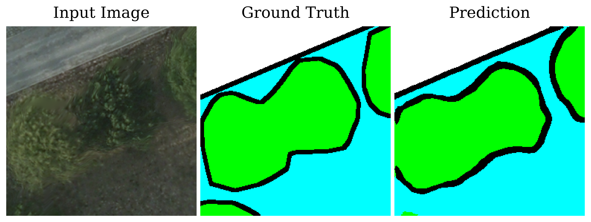
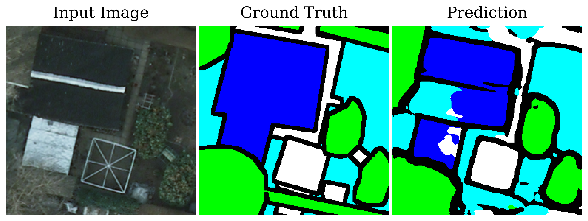
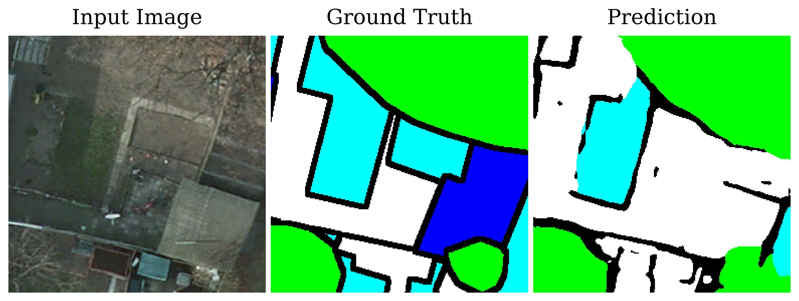
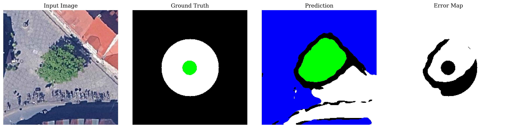
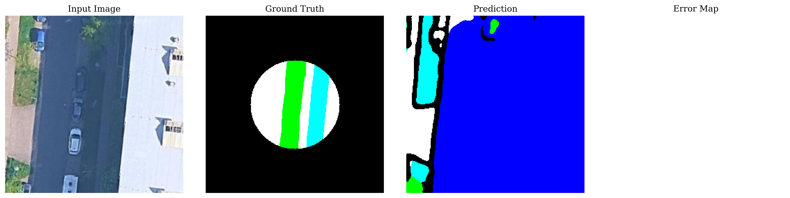
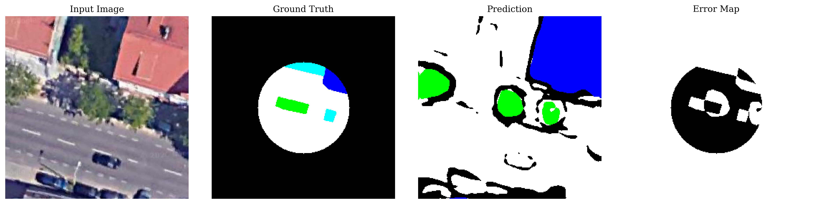
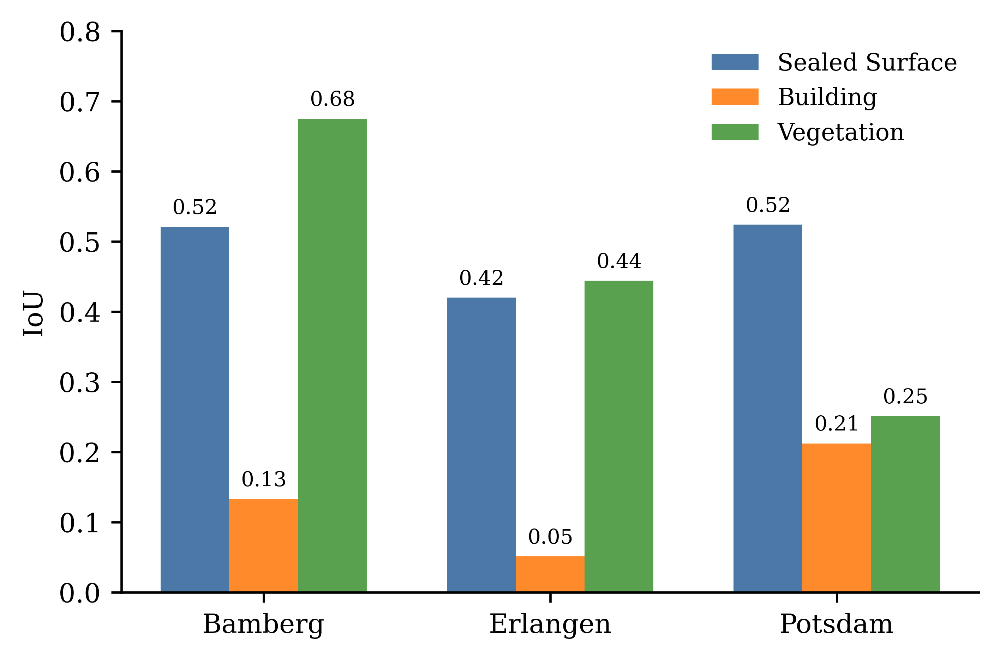

# Improving Urban Vegetation Segmentation: A Cross-City Evaluation Using Aerial Imagery

## Overview

This project investigates **cross-city domain generalization** for semantic segmentation of urban aerial imagery.

A U-Net model with a ResNet-34 encoder is trained on the **ISPRS Potsdam dataset** and evaluated on unseen **QGIS-derived datasets** from:

- Bamberg
- Erlangen
- Potsdam

The project evaluates how well a vegetation segmentation model trained on one city generalizes to unseen urban environments without domain adaptation.

The study focuses on:

- Cross-city domain generalization
- Urban density and structural complexity
- Vegetation segmentation robustness
- Shadow-related segmentation errors

---

## Motivation

Urban vegetation mapping is important for:

- environmental monitoring
- urban planning
- biodiversity analysis
- micro-climate modelling
- tree and soil-moisture studies

Manual annotation of urban vegetation is difficult and does not scale effectively across large geographic regions. However, segmentation models trained on benchmark datasets often fail when deployed on unseen cities due to domain shift.

This project evaluates those failure modes under a **source-only deployment setup**, where no target-domain adaptation is performed.

---

## Dataset

### Training Dataset

- ISPRS Potsdam dataset

### Target Datasets

QGIS-derived datasets created from Google Satellite aerial imagery:

- Bamberg
- Erlangen
- Potsdam

---

## Segmentation Classes

### Training Classes

- Background
- Sealed Surface
- Building
- Low Vegetation
- Tree

### Evaluation Classes

For cross-city evaluation:

- Sealed Surface
- Building
- Vegetation

Low vegetation and tree classes are merged to align with the QGIS annotation structure.

---

## Model

- Architecture: U-Net, ResNet-34 encoder, ImageNet pretrained backbone
- Framework: PyTorch
- Data Augmentation: horizontal flipping, rotation, brightness adjustment, contrast variation

---

## Cross-City Evaluation Datasets

The evaluation datasets created from Google Satellite images derived through QGIS were generated for:

- Bamberg
- Erlangen
- Potsdam

Each dataset contains:

- `rgb/` – extracted aerial image tiles
- `mask_index/` – corresponding semantic annotation masks

These datasets were used for cross-city evaluation and domain-shift analysis.

---

## Project Structure

```text
project/
├── docs/                       # report and presentation
├── models/                     # trained model checkpoints
├── qgis/                       # script to extract images through QGIS
├── results/
│   ├── figures/                # plots and qualitative visualizations
│   └── predictions/            # sample cross-city prediction outputs
│       ├── bamberg/
│       ├── erlangen/
│       └── potsdam/
│
├── src/
│   ├──prepare_data.py          # ISPRS preprocessing and tile generation
│   ├── train.py                # U-Net training pipeline
│   ├── infer_and_visualize.py  # qualitative inference on validation images
│   ├── eval_isprs_baseline.py  # ISPRS baseline evaluation
│   ├── eval_qgis.py            # cross-city evaluation on QGIS datasets
│   ├── shadow_analysis.py      # shadow impact analysis
│   └── cityscape.py            # urban density/cityscape analysis
│
├── val_qgis_bamberg/           #
├── val_qgis_erlangen/          # Satellite images derived through QGIS platform
├── val_qgis_potsdam/           #
│
├── potsdam_palette.json        # ISPRS Potsdam RGB-to-class label mapping used for mask conversion
├── README.md
└── requirements.txt
```

---

## Notes

1. The ISPRS Potsdam dataset is not included in this repository and must be downloaded separately from the official ISPRS benchmark website.
2. Experiments were originally executed on the NHR@FAU HPC cluster using Slurm job scripts. For simplicity, the repository documents the equivalent Python commands used by the job scripts.
3. In the original experimental pipeline, prediction outputs were stored under internal validation directories (e.g. `val_qgis_erlangen/eval_outputs/`). For repository organization and easier qualitative inspection, representative outputs were reorganized under `results/predictions/`.

---

## Requirements

Install dependencies:

```
git clone git@mad-srv.informatik.uni-erlangen.de:<username>/satellite-image-segmentation-project.git

cd satellite-image-segmentation-project

pip install -r requirements.txt
```

---

## Dataset Preparation

### 1. Download ISPRS Potsdam

Download the ISPRS Potsdam dataset from:

https://www.isprs.org/resources/datasets/benchmarks/UrbanSemLab/Default.aspx

Extract:

- `2_Ortho_RGB/` (RGB aerial imagery)
- `5_Labels_all_noBoundary/` (RGB semantic labels)

### 2. Prepare Training Dataset

Run:

```bash
python src/prepare_data.py \
  --img_dir 2_Ortho_RGB \
  --mask_dir 5_Labels_all_noBoundary \
  --out_dir dataset/potsdam_2 \
  --tile_size 256 \
  --stride 128 \
  --val_split 0.2 \
  --palette potsdam_palette.json
```

The script:

- converts RGB masks to class indices
- extracts 256×256 tiles with 50% overlap
- removes tiles with insufficient tree coverage
- creates train/validation splits
- generates CSV files for training

## Training

```
python src/train.py
```

---

## Inference

```
python src/infer_and_visualize.py
```

Running inference generates prediction visualizations and evaluation outputs in a local output directory.

---

## Evaluation

ISPRS evaluation:

```
python src/eval_isprs_baseline.py
```

QGIS evaluation:

The evaluation script is executed separately for each city dataset.

Update the dataset configuration in `eval_qgis.py` to select:

- `val_qgis_bamberg`
- `val_qgis_erlangen`
- `val_qgis_potsdam`

and run:

```
python src/eval_qgis.py
```

Shadow analysis:

```
python src/shadow_analysis.py
```

Cityscape visualization:

```
python src/cityscape.py
```

---

## Metrics

Evaluation metrics:

- Mean IoU (mIoU)
- Intersection over Union (IoU)
- Precision
- Recall
- Confusion matrices

---

## Key Findings

- Strong in-domain performance on ISPRS validation data
- Significant performance degradation across unseen cities
- Urban density strongly impacts vegetation segmentation quality
- Shadows introduce localized segmentation errors

---

## Qualitative Results

Example segmentation output on the ISPRS Potsdam dataset.





Example segmentation output from Bamberg, Erlangen, Potsdam:




Cross-city segmentation IoU comparison across QGIS-derived Bamberg, Erlangen, and Potsdam:



## Author

[Shubhasmita Roy](https://www.linkedin.com/in/shubhasmita-roy-858209191/),
Masters in Artificial Intelligence
FAU Erlangen-Nürnberg

## Acknowledgements

[ISPRS 2D Semantic Labeling Contest](https://www.isprs.org/resources/datasets/benchmarks/UrbanSemLab/2d-sem-label-potsdam.aspx)

[NHR @ FAU](https://hpc.fau.de/) for compute resources

[Thomas Maier](https://www.mad.tf.fau.de/person/thomas-maier/),
Researcher & PhD Candidate
Department Artificial Intelligence in Biomedical Engineering (AIBE)
